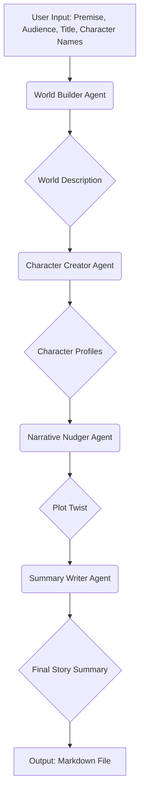

# Idea Weaver

**Let your local AI be your creative muse.**

Idea Weaver is a multi-agentic application designed to be your creative partner. It leverages a team of specialized AI agents, powered by local Large Language Models (LLMs) via **Ollama**, to transform a simple story premise into a well-structured narrative concept. The entire creative process is orchestrated by **CrewAI** and is fully observable through **LangSmith**, giving you a transparent look into the AI's reasoning process.

### Multi-Agent Orchestration Flow

The application employs a sequential pipeline where each agent builds upon the work of the previous one, creating a comprehensive story scaffold. This structured collaboration ensures that all aspects of the story concept are coherent and well-developed.



---

## What is Idea Weaver?

This application does not write a complete, finished story. Instead, it acts as a **creative partner** to rapidly develop a detailed **story concept or scaffold** from a simple idea.

Think of it as an automated, high-speed brainstorming session with a team of creative specialists. Its main goal is to take you from a single spark of an idea (e.g., "a hobbit and a wizard on a journey") to a structured, well-defined plan that you, the writer, can then use to write the actual story.

### The Process

1.  **The User's Initial Idea:** The process starts with you providing a basic premise, a target audience, and a title. You also choose whether to have character names generated by the AI or to enter them yourself.
2.  **The Assembly of the AI "Crew":** The application assembles a team of four specialized AI agents.
3.  **The Collaborative Brainstorming Process:**
    *   **World Builder:** Expands the premise into a rich world.
    *   **Character Creator:** Creates compelling characters for that world in a human-readable format.
    *   **Narrative Nudger:** Introduces a plot twist.
    *   **Summary Writer:** Synthesizes everything into a short summary.
4.  **The Final Output:** The application compiles all the outputs into a single Markdown file, which serves as your story blueprint.

---

## Features

-   **🧙‍ World Builder** → builds out rich world details
-   **👤 Character Creator** → generates character archetypes and quirks
-   **📝 AI-Generated Title Option** → provides an option to have the AI generate a story title
-   **✍️ Summary Writer** → writes a short, engaging summary of the story
-   **📊 LangSmith Tracing** → logs LLM interactions for observability
-   **💾 Local file output** → saves final result using story title

---

## Requirements

Use a virtual environment and install the dependencies. `uv` is recommended for performance:

```bash
# Install dependencies using uv
uv pip install -r requirements.txt
```

---

## Project Structure

```
idea-weaver/
├── agents/
│   ├── character_creator.py
│   ├── character_name_generator.py
│   ├── narrative_nudger.py
│   ├── summary_writer.py
│   ├── title_generator.py
│   └── world_builder.py
├── outputs/
│   └── *.md
├── utils/
│   ├── llm_loader.py
│   ├── markdown_builder.py
│   ├── prompt_templates.py
│   ├── save_to_markdown.py
│   └── startup_checker.py
```

---

## `.env` Configuration

Create a `.env` file in the root directory and add your LangSmith and Ollama details:

```
# LangSmith Configuration
LANGSMITH_TRACING_V2=<true_or_false>
LANGSMITH_ENDPOINT=<YOUR_LANGSMITH_ENDPOINT>
LANGSMITH_API_KEY=<YOUR_LANGSMITH_API_KEY>
LANGSMITH_PROJECT=<YOUR_LANGSMITH_PROJECT_NAME>

# Ollama Configuration (Optional)
OLLAMA_BASE_URL=<YOUR_OLLAMA_BASE_URL>
OLLAMA_MODEL=<YOUR_OLLAMA_MODEL_NAME>
```

---

## How to Run

1.  **Set up your environment:**
    - Create a virtual environment using `uv`:
        ```bash
        uv venv
        ```
    - Activate the virtual environment:
        ```bash
        source .venv/bin/activate
        ```
2.  **Run the app:**
    ```bash
    python main.py
    ```
