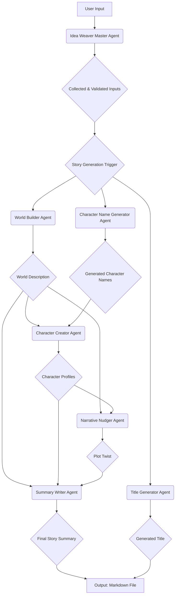

# Idea Weaver

**Let your local AI be your creative muse.**

Idea Weaver is a multi-agentic application designed to be your creative partner. It leverages a team of specialized AI agents, powered by local Large Language Models (LLMs) via **Ollama**, to transform a simple story premise into a well-structured narrative concept. This multi-agent architecture allows for modularity, where each agent brings specialized expertise to a specific stage of story development, enhancing robustness and scalability. The entire creative process is orchestrated by **CrewAI** and is fully observable through **LangSmith**, giving you a transparent look into the AI's reasoning process.

### Multi-Agent Orchestration Flow

The application employs a sophisticated multi-agent pipeline. The **Idea Weaver Master Agent** first engages the user to collect and validate all necessary inputs. Once collected, these inputs are then passed to a sequential pipeline where specialized agents build upon each other's work, creating a comprehensive story scaffold.



---

## What is Idea Weaver?

This application does not write a complete, finished story. Instead, it acts as a **creative partner** to rapidly develop a detailed **story concept or scaffold** from a simple idea.

Think of it as an automated, high-speed brainstorming session with a **team of AI specialists (agents)**. Its main goal is to take you from a single spark of an idea (e.g., "a hobbit and a wizard on a journey") to a structured, well-defined plan that you, the writer, can then use to write the actual story.

### The Process

1.  **Initial Interaction with the Master Agent (Human-in-the-Loop):** The process begins with you interacting with the **Idea Weaver Master Agent** through an intuitive chat interface. This agent intelligently guides you through providing all necessary details: a basic premise, target audience, title choice (generate or provide your own), the number of characters, and their names (which can be provided sequentially or generated by AI).
2.  **Master Agent Orchestration & Input Validation:** The Master Agent is responsible for understanding your intent, asking clarifying questions, validating your inputs (e.g., ensuring character counts are correct), and confirming all required information is collected.
3.  **Core Story Generation:** Once all inputs are collected and validated by the Master Agent, the application assembles a team of specialized AI agents (World Builder, Character Creator, Narrative Nudger, Summary Writer). These agents then collaboratively brainstorm and develop the story concept based on your provided details.
4.  **The Final Output:** The application compiles all the generated outputs into a single Markdown file, which serves as your story blueprint, and also displays a clean, formatted version in the UI.

---

## Features

### Interactive Chat UI (Powered by Streamlit)

Idea Weaver features a user-friendly, interactive chat interface built with **Streamlit**. This UI provides a conversational experience, allowing you to easily input your story details and receive the generated concepts in a clear, readable format.

-   **Intelligent Input Handling:** Smartly handles user input for titles and character names, including sequential input for multiple characters, orchestrated by the Master Agent.
-   **Robust Error Handling:** Gracefully manages backend errors, displaying user-friendly messages without exposing code details.
-   **Clean Output Formatting:** Provides separate, clean text formatting for the UI output, distinct from the Markdown file.
-   **Master Agent Orchestration:** A dedicated agent manages the entire input collection and validation process, making the interaction more natural and robust.
-   **World Builder** → builds out rich world details
-   **Character Creator** → generates character archetypes and quirks
-   **AI-Generated Title Option** → provides an option to have the AI generate a story title
-   **Summary Writer** → writes a short, engaging summary of the story
-   **LangSmith Tracing** → logs LLM interactions for observability
-   **Local file output** → saves final result using story title

---


## Project Structure

```
idea-weaver/
├── backend/
│   ├── agents/
│   │   ├── character_creator.py
│   │   ├── character_name_generator.py
│   │   ├── idea_weaver_master.py
│   │   ├── narrative_nudger.py
│   │   ├── summary_writer.py
│   │   ├── title_generator.py
│   │   └── world_builder.py
│   ├── api.py
│   ├── main.py
│   ├── prompts/
│   │   ├── character_creator_prompt.py
│   │   ├── character_name_generator_prompt.py
│   │   ├── master_agent_follow_up_prompt.py
│   │   ├── master_agent_initial_prompt.py
│   │   ├── narrative_nudger_prompt.py
│   │   ├── story_summary_prompt.py
│   │   ├── title_generator_prompt.py
│   │   └── world_builder_prompt.py
│   └── utils/
│       ├── llm_loader.py
│       ├── markdown_builder.py
│       ├── prompt_templates.py
│       ├── save_to_markdown.py
│       └── startup_checker.py
├── frontend/
│   ├── api_client.py
│   ├── app.py
│   └── ui.py
├── outputs/
│   └── *.md
```

---

## `.env` Configuration

Create a `.env` file in the root directory and add your LangSmith and Ollama details:

```
# LangSmith Configuration
LANGSMITH_TRACING_V2=<true_or_false>
LANGSMITH_ENDPOINT=<YOUR_LANGSMITH_ENDPOINT>
LANGSMITH_API_KEY=<YOUR_LANGSMITH_API_KEY>
LANGSMITH_PROJECT=<YOUR_LANGSMITH_PROJECT_NAME>

# Ollama Configuration
OLLAMA_BASE_URL=<YOUR_OLLAMA_BASE_URL>
OLLAMA_MODEL=<YOUR_OLLAMA_MODEL_NAME>
```

---

## How to Run

### 1. Set up your environment:

- Create a virtual environment using `uv`:
    ```bash
    uv venv
    ```
- Activate the virtual environment:
    ```bash
    source .venv/bin/activate
    ```
- Install the project in editable mode:
    ```bash
    uv pip install -e .
    ```

### 2. Run the App:

#### a) Run the Backend Server:

In one terminal, run the following command to start the backend server:

```bash
uvicorn backend.main:app --reload
```

#### b) Run the Interactive UI (Recommended):

In a second terminal, run the following command to start the frontend application:

```bash
streamlit run frontend/app.py
```