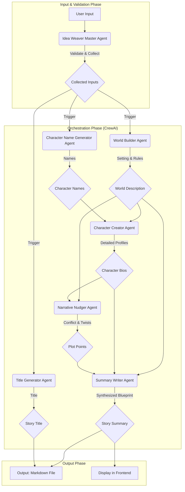

# Idea Weaver

Idea Weaver is a multi-agentic application designed to be your creative partner. It leverages a team of specialized AI agents, powered by Large Language Models (LLMs) via **Ollama** or **Google Gemini API**, to transform a simple story premise into a well-structured narrative concept. 

This multi-agent orchestration allows for modularity, where each agent brings specialized expertise to a specific stage of story development, enhancing robustness and scalability. The entire creative process is orchestrated by **CrewAI** and is fully observable through **LangSmith**, giving you a transparent look into the AI's reasoning process.

---

## Architecture Design

Idea Weaver follows a decoupled client-server architecture, ensuring a clear separation between the user interface and the core agentic logic.

- **Frontend (Streamlit):** A conversational UI that manages the interactive session with the user. It communicates with the backend via RESTful APIs, providing a clean and intuitive interface for story configuration.
- **Backend (FastAPI):** Serves as the orchestration layer, managing API requests, agent state, and the execution of the multi-agent pipeline.
- **Multi-Agent Orchestration (CrewAI):** Leverages CrewAI to define specialized agents and sequential tasks. This framework handles the "handoffs" between agents, ensuring context is preserved and built upon at each stage.
- **LLM Integration Layer:** A modular loader that supports both local LLMs via **Ollama** and cloud-based models via **Google Gemini API**, configurable through environment variables.
- **Observability (LangSmith):** Integrated tracing provides deep visibility into agent thought processes, tool calls, and LLM latency.

---

## Multi-Agent Orchestration Flow

The application employs a sophisticated multi-agent pipeline. The **Idea Weaver Master Agent** first engages the user to collect and validate all necessary inputs. Once collected, these inputs are passed to a sequential pipeline where specialized agents build upon each other's work, creating a comprehensive story scaffold.

### Detailed Workflow

1.  **Input & Validation:** The Master Agent (Human-in-the-Loop) uses stateful tracking to ensure the premise, audience, title preferences, and character counts are correctly captured before triggering the generation.
2.  **Creative Brainstorming:**
    - **World Builder:** Defines the setting's geography, history, and unique rules.
    - **Generators:** Simultaneously handles title and character name generation (if requested).
    - **Character Creator:** Synthesizes the world details and names into rich character profiles.
    - **Narrative Nudger:** Analyzes the world and characters to inject conflict and plot twists.
3.  **Synthesis:** The **Summary Writer** compiles all previous outputs into a cohesive narrative blueprint.


```mermaid
graph TD
    subgraph "Input & Validation Phase"
        U[User Input] --> MA(Idea Weaver Master Agent)
        MA --> |Validate & Collect| CI{Collected Inputs}
    end

    subgraph "Orchestration Phase (CrewAI)"
        CI --> |Trigger| WB(World Builder Agent)
        CI --> |Trigger| TGA(Title Generator Agent)
        CI --> |Trigger| CNGA(Character Name Generator Agent)
        
        WB --> |Setting & Rules| W_OUT{World Description}
        CNGA --> |Names| N_OUT{Character Names}
        TGA --> |Title| T_OUT{Story Title}

        W_OUT & N_OUT --> CC(Character Creator Agent)
        CC --> |Detailed Profiles| C_OUT{Character Bios}

        W_OUT & C_OUT --> NN(Narrative Nudger Agent)
        NN --> |Conflict & Twists| NN_OUT{Plot Points}

        W_OUT & C_OUT & NN_OUT --> SW(Summary Writer Agent)
        SW --> |Synthesized Blueprint| S_OUT{Story Summary}
    end

    subgraph "Output Phase"
        S_OUT & T_OUT --> MD[Output: Markdown File]
        S_OUT --> UI[Display in Frontend]
    end
```

---

## Features

- **Master Agent Orchestration:** A dedicated agent manages the entire input collection and validation process, making the interaction natural and robust.
- **Stateful Conversational Management:** Explicit state tracking guides the conversation, ensuring a logical flow of questions and validations.
- **Specialized AI Agents:**
    - **World Builder** → builds out rich world details.
    - **Character Creator** → generates character archetypes and quirks.
    - **Narrative Nudger** → introduces creative conflicts and plot twists.
    - **Summary Writer** → writes a short, engaging summary of the story.
- **AI-Generated Title Option:** Provides an option to have the AI generate a story title or use your own.
- **LangSmith Tracing:** Logs all LLM interactions for full observability.
- **Local File Output:** Saves the final result using the story title in a structured Markdown format.

---

## `.env` Configuration

Create a `.env` file in the root directory and add your LangSmith and LLM details:

```
# LangSmith Configuration
LANGSMITH_TRACING_V2=true
LANGSMITH_ENDPOINT="https://api.smith.langchain.com"
LANGSMITH_API_KEY=<YOUR_LANGSMITH_API_KEY>
LANGSMITH_PROJECT=<YOUR_LANGSMITH_PROJECT_NAME>

# LLM Provider Configuration
# Set LLM_PROVIDER to either "OLLAMA" or "GEMINI"
LLM_PROVIDER="OLLAMA" 

# --- Ollama Configuration (if LLM_PROVIDER="OLLAMA") ---
OLLAMA_BASE_URL="http://localhost:11434"
OLLAMA_MODEL="llama3"

# --- Gemini API Configuration (if LLM_PROVIDER="GEMINI") ---
GEMINI_API_KEY=<YOUR_GEMINI_API_KEY>
GEMINI_MODEL="gemini-1.5-flash"
```

---

## How to Run

### 1. Set up your environment:

- Create a virtual environment using `uv`:
    ```bash
    uv venv
    ```
- Activate the virtual environment:
    ```bash
    source .venv/bin/activate
    ```
- Install the project in editable mode:
    ```bash
    uv pip install -e .
    ```

### 2. Run the App:

#### a) Run the Backend Server:

In one terminal, start the FastAPI server:

```bash
uvicorn backend.main:app --reload
```

#### b) Run the Interactive UI:

In a second terminal, start the Streamlit application:

```bash
streamlit run frontend/app.py
```
